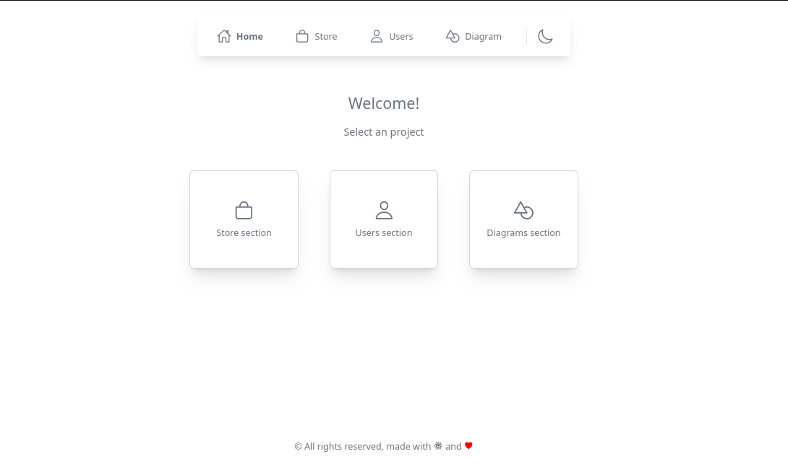

<div align="center">
  
</div>

<div align="center">
  <h1 align="center">Library</h1>
   <p>Multiple projects in one place 📚</p>
</div>

<div align="center">
  <h3>
    <a href="https://react-library-dev.netlify.app/">
      Demo
    </a>
    <span> | </span>
    <a href="https://github.com/Dave136/library">
      Source
    </a>
    <span>
  </h3>
</div>

<div align="center">
  
</div>

<!-- TABLE OF CONTENTS -->

## Table of Contents

- [Overview](#overview)
  - [Built With](#built-with)
- [Features](#features)
- [How to use](#how-to-use)
- [Contact](#contact)

<!-- OVERVIEW -->

## Overview



Simple collection of projects, in one place.

You can see a [demo](https://uploader-image-app.netlify.app/)

### Built With

- [React](https://reactjs.org/)
- [React router](https://reactrouter.com/en/main)
- [ReactFlow](https://reactflow.dev/)
- [Axios](https://axios-http.com/)
- [Windicss](https://windicss.com/)
- [react-base-table](https://autodesk.github.io/react-base-table/)
- [react-paginate](https://www.npmjs.com/package/react-paginate)
- [react-icons](https://react-icons.github.io/react-icons/)
- [Swiper](https://swiperjs.com/react)
- [Zustand](https://zustand-demo.pmnd.rs/)

## Features

This application was created as a frontend challenge. There is a cool  features like:

- React router dom (using new api features)
- Error page
- Responsive
- Skeleton loader
- Mental mind with reactflow
- Pagination

## How To Use

To clone and run this application, you'll need [Git](https://git-scm.com), [Node.js](https://nodejs.org/en/download/) (which comes with [npm](http://npmjs.com)) and [Pnpm](https://pnpm.io/installation) installed on your computer. From your command line:

> pnpm is optional, you could also install the dependencies with npm

```bash
# Clone this repository
$ git clone https://github.com/Dave136/library

# Install dependencies
$ pnpm install

# Run the app
$ pnpm dev
```

## Contact

- Website [dave136.netlify.app](https://dave136.netlify.app/)
- GitHub [@dave136](https://github.com/Dave136)
- Twitter [@davejs4](https://twitter.com/davejs4)
